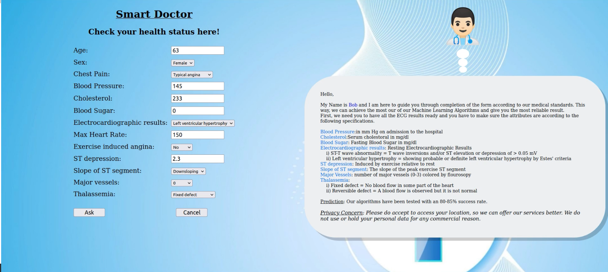
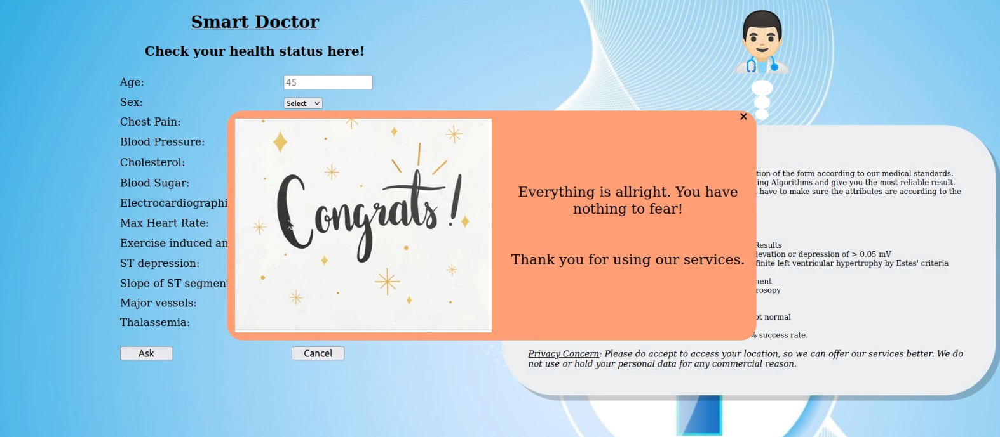
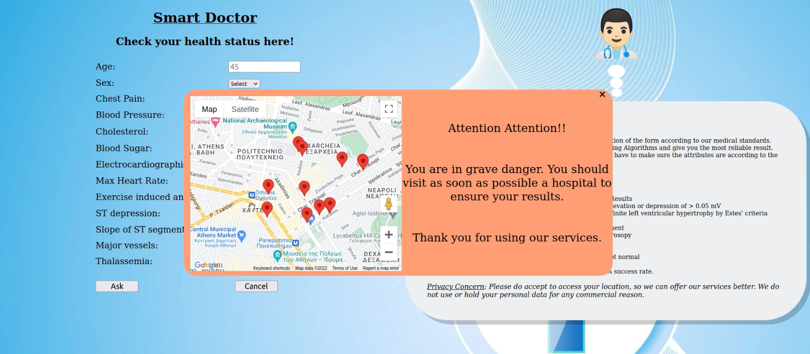

# smartDoc
University Project. Java Spring + Python ML

Bob explains how to fill the form, patient fills the form, and score is presented on screen along with required procedure guidelines.

## Bob Explains

## Scenario 1

## Scenario 2

## How it All Works

